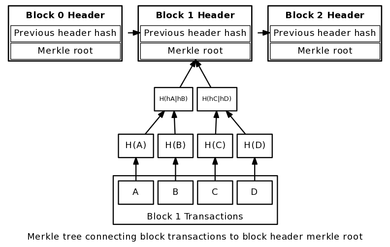

# 01 Overview of blockchain

## What it is

courtesy of David Harding - [stackoverflow](https://bitcoin.stackexchange.com/questions/41208/can-a-blockchain-be-created-that-forgets-transactions-whose-outputs-have-been-sp)

## What are the important properties

* Tamper-proof (thanks to merlkle trees and cryptography)
* Pseudononymous
* AP but only eventually consistent

## Different types of blockchains

* Private
* Consortium
* Public

## What it enables

* Proofs
* Tokens
* Escrows

which then allows many business use cases

continue [here](https://github.com/vincentserpoul/prez-ethereum-dev/blob/master/01_blockchain_overview/README.md)